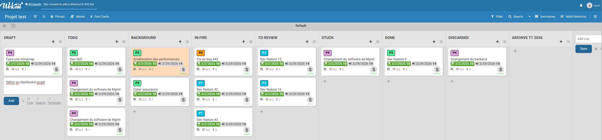

# Kanban

[Source wikipedia](https://fr.wikipedia.org/wiki/Kanban_(d%C3%A9veloppement))

## Introduction

La gestion de projet en mode Kanban est une approche visuelle, 
flexible et continuelle qui permet de gérer le flux de travail de manière optimale, 
en se concentrant sur l'amélioration continue, l'optimisation des processus 
et la réduction du gaspillage. 

Kanban est particulièrement adapté aux environnements où le travail est fluide, 
et dont priorités changent fréquemment.

Il s'inspire des principes de lean management et est basé sur la visualisation des tâches, 
la limitation du travail en cours (WIP), et l'amélioration continue.

## Principes fondamentaux

1. **Visualisation du flux de travail**

L’un des principes clés de Kanban est de visualiser l'ensemble du processus de travail, 
de la tâche à faire à la tâche terminée. 
Cela permet à l’équipe de voir en temps réel l’état d’avancement 
des différentes tâches et d’identifier immédiatement les goulots d’étranglement 
ou les zones de congestion.

2. **Limitation du travail en cours (WIP : Work In Progress)**

Kanban impose des limites sur le nombre de tâches qu'une équipe peut traiter simultanément 
à chaque étape du flux de travail. 
Cela permet de réduire le multitâche, de se concentrer sur la tâche en cours 
et d'éviter les goulets d'étranglement.

Exemple : Une colonne peut être limitée à 3 tâches en cours. 
Si cette limite est atteinte, l'équipe doit terminer l'une des tâches avant d'en commencer une nouvelle.

On parle également de poids, de capacité, ou de compléxité en fonction de
la charge admissible par l'équipe.

3. **Gestion du flux**

L'objectif est d'améliorer la fluidité du travail en réduisant 
les délais de passage des tâches d'une colonne à l'autre. 
Cela inclut la gestion des goulots d'étranglement, 
la réduction des délais et la surveillance des performances du flux 
pour assurer que les tâches sont livrées de manière constante et efficace.

4. **Amélioration continue (Kaizen)**

Kanban encourage une approche d'amélioration continue, i
en analysant régulièrement le flux de travail et en apportant des ajustements 
pour rendre le processus plus efficace. 
Cela passe par l’utilisation des métriques 
(telles que le lead time, le cycle time, et le throughput) 
pour évaluer la performance du processus et identifier les points d'amélioration.

## Les composantes

1. **Le tableau Kanban**

Un tableau visuel qui représente les différentes étapes du processus de travail 
et dans lequel les tâches sont déplacées. 
Il peut être physiquement réalisé sur un tableau blanc avec des post-it 
ou bien digitalisé via des outils comme Trello, Jira, ou Asana.

Colonnes classiques du tableau Kanban :

- À faire (Backlog)
- En cours (Work in Progress)
- Terminé (Done)

2. **Les cartes Kanban**

Chaque carte Kanban représente une tâche ou une unité de travail spécifique. 
Elle contient généralement des informations essentielles sur la tâche, telles que :

- Titre ou description de la tâche
- Responsable ou équipe affectée
- Date d’échéance
- Priorité

Les cartes se déplacent à travers les colonnes du tableau 
à mesure que les tâches progressent dans le flux de travail.

3. **Les limites de WIP (Work In Progress)**

La limitation du travail en cours est une règle fondamentale 
pour éviter que l’équipe ne soit surchargée. 
Cela garantit que l’équipe travaille sur un nombre limité de tâches à la fois, 
ce qui favorise une plus grande concentration et permet de terminer les tâches plus rapidement.

## Processus de travail

1. **Établir le flux de travail**

La première étape pour mettre en place un système Kanban est de définir le flux de travail. 
Cela implique de déterminer quelles sont les étapes que chaque tâche doit franchir pour être terminée.

Par exemple, dans un projet de développement logiciel, les étapes pourraient être :

- Demande de fonctionnalités
- Conception
- Développement
- Tests
- Déploiement

Chaque étape du processus devient une colonne dans le tableau Kanban.

2. **Définir les tâches**

Une fois le flux de travail établi, les tâches à réaliser (ou éléments de travail) 
sont identifiées et ajoutées sous forme de cartes dans la colonne "À faire" du tableau.

3. **Limiter le WIP (travail en cours)**

Des limites sont fixées pour chaque colonne afin de s'assurer 
que l’équipe ne prend pas en charge trop de tâches simultanément. 

Par exemple, la colonne "En cours" pourrait être limitée à 3 tâches en même temps, 
ce qui oblige l’équipe à terminer une tâche avant d'en commencer une nouvelle.

Cela peut se définir également via un nombre indiquant la compléxité et à confronter
avec la capacité de l'équipe.

Exemple : la capacité de l'équipe est de 10, une carte peut avoir un poid de 2 ou 5...

4. **Prioriser les tâches**

Les tâches sont généralement priorisées, soit par ordre d'importance ou d’urgence, 
pour garantir que les éléments à haute priorité sont traités en premier. 

Le Product Owner ou le gestionnaire de projet veille 
à ce que les tâches les plus importantes soient en haut du tableau.

5. **Suivre l’avancement**

Les tâches sont déplacées à travers le tableau Kanban en fonction de leur progression dans le flux de travail. Une fois qu'une tâche atteint la colonne "Terminé", elle est considérée comme complète.

6. **Analyse des métriques et amélioration continue**

Kanban repose sur l'amélioration continue du processus. 
Les équipes doivent suivre des métriques pour évaluer leur performance 
et détecter des opportunités d'amélioration. 

Les métriques courantes incluent :

- Lead time : Le temps total qu'une tâche prend pour être réalisée, du début à la fin.
- Cycle time : Le temps que prend une tâche pour passer d'une étape à une autre.
- Throughput : Le nombre de tâches terminées dans un délai donné.

Ces données permettent de prendre des décisions éclairées pour améliorer la fluidité 
du processus et réduire les goulets d’étranglement.

## Les avantages

1. **Visualisation claire du travail :**

Le tableau Kanban offre une vue d'ensemble instantanée de toutes les tâches en cours, 
de leur état et de leur priorité, ce qui permet à l’équipe 
et aux parties prenantes de suivre facilement l'avancement.

2. **Amélioration continue :**

Le système encourage l’amélioration continue grâce à des réunions régulières 
(par exemple, les rétrospectives) et à l’analyse des métriques pour optimiser les processus.

3. **Réduction du multitâche :**

En limitant le nombre de tâches en cours, Kanban empêche les membres de l’équipe 
de se disperser et les aide à se concentrer sur une tâche à la fois, augmentant ainsi l’efficacité.

4. **Adaptabilité :**

Kanban est flexible et permet de facilement s’adapter aux changements de priorités. 
Il est donc particulièrement adapté aux projets dont le flux de travail est moins prévisible 
ou dont les priorités évoluent fréquemment.

5. **Équilibre de la charge de travail :**

Avec la gestion du WIP et la limitation du nombre de tâches par étape, 
Kanban permet une répartition plus équilibrée du travail, 
réduisant ainsi les risques de surcharge de l’équipe.

6. **Facilité d’adoption :**

Kanban est souvent plus facile à mettre en place que d’autres méthodologies Agiles comme Scrum, 
car il n’y a pas besoin de réorganiser profondément l’équipe ou les processus. 
Il suffit de définir les étapes de travail et de commencer à visualiser le flux.

## Outils

- Trello
- Wekan
- Jira

## Exemples de tableau kanban :

## Conclusion

La gestion de projet en mode Kanban est une approche flexible 
et visuelle idéale pour gérer des projets où le flux de travail est continu 
et où les priorités évoluent régulièrement. 

En visualisant les tâches, en limitant le travail en cours et en cherchant 
constamment à améliorer les processus, Kanban permet aux équipes de travailler 
de manière plus fluide, collaborative et efficace. 

C'est une méthode particulièrement adaptée aux projets qui nécessitent une réactivité
