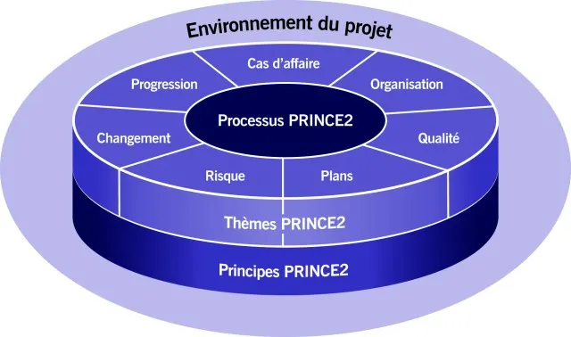
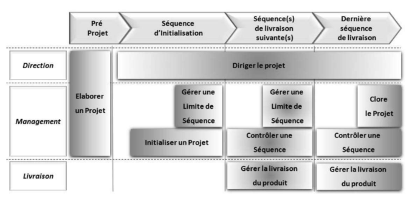

# PRINCE2

* [WIKIWAI-PRINCE2](https://www.wikiwai.com/gestion-de-projet/methodes-de-gestion-de-projet/prince2/2020/supernova/comprendre-la-methode-prince2/)

## Introduction

PRINCE2 (PRojects IN Controlled Environments, version 2) est une méthodologie de gestion de projet 
largement reconnue et utilisée dans le monde entier. 

Développée par le gouvernement britannique, PRINCE2 est une approche structurée 
en processus pour gérer efficacement les projets, 
quels que soient leur taille, leur complexité ou leur domaine d’application. 

PRINCE2 se distingue par son orientation sur la gestion des risques, des ressources et de la qualité.

## Les 7 Principes fondamentaux de PRINCE2 :

1. **Justification continue du projet*

Un projet doit avoir une raison d’être valable et documentée (le "Business Case").
La justification doit être réévaluée à chaque étape : si elle disparaît, le projet doit être arrêté.

2. **Tirer les leçons de l’expérience**

Capitaliser sur les retours d’expérience (REX) des projets passés pour éviter de répéter les erreurs et améliorer les pratiques.

3. **Rôles et responsabilités définis**

Chaque acteur du projet (client, fournisseur, utilisateur, etc.) doit avoir un rôle clair et une responsabilité précise dans une structure organisationnelle définie.

4. **Gestion par étapes (ou séquences)**

Le projet est divisé en phases gérées individuellement, avec des points de décision (go/no-go) à la fin de chaque étape.

5. **Gestion par exception**

Des tolérances (budget, délais, qualité) sont définies pour chaque niveau de responsabilité.
Si les écarts dépassent ces tolérances, le niveau hiérarchique supérieur est alerté pour prise de décision.

6. **Orientation produit**

Le projet est axé sur la livraison de produits (livrables) conformes aux exigences, avec une description précise de leurs caractéristiques et critères d’acceptation.

7. **Adaptation à l’environnement du projet**

PRINCE2 est flexible : la méthodologie doit être adaptée à la taille, la complexité, l’importance et l’environnement du projet.

## Les 7 processus de PRINCE2 :

PRINCE2 divise la gestion de projet en sept processus qui guident la planification, 
la surveillance et la clôture du projet. 

Chaque processus est associé à un ou plusieurs des principes mentionnés précédemment :

1. **Démarrer un projet (Starting Up a Project) :** 

Ce processus consiste à définir si le projet est viable et justifié. Il inclut la préparation du projet (comme la création du dossier de projet) et la définition des premières responsabilités.

2. **Diriger un projet (Directing a Project) :** 

C'est le processus de supervision global du projet par le comité de direction. Il définit les décisions clés à prendre à chaque étape du projet et assure la validation des livrables.

3. **Contrôler une étape (Controlling a Stage) :** 

Ce processus gère chaque étape du projet, surveille les progrès, ajuste les actions nécessaires et traite des problèmes qui peuvent survenir pendant cette phase.

4. **Gérer la livraison des produits (Managing Product Delivery) :** 

Ce processus est centré sur la gestion des tâches et la livraison des livrables du projet. Il définit clairement ce qui doit être livré, quand et à quel niveau de qualité.

5. **Gérer les limites de l’étape (Managing Stage Boundaries) :** 

Ce processus assure une gestion en toute transparence entre les étapes. Il garantit que chaque nouvelle phase commence de manière formelle et documentée, avec des ajustements si nécessaire.

6. **Clôturer un projet (Closing a Project) :** 

À la fin du projet, ce processus veille à ce que toutes les activités soient complètes, que les livrables soient validés et qu’un rapport de clôture soit rédigé pour formaliser la fin du projet.

7. **Gérer les risques (Managing Risks) :** 

Bien que ce processus ne soit pas à proprement parler l’un des principaux processus de PRINCE2, il est intégré dans tous les processus. La gestion des risques est essentielle tout au long du projet pour identifier, évaluer et atténuer les risques.

## Les thèmes de PRINCE2

PRINCE2 met également l’accent sur sept thèmes essentiels qui sont utilisés 
pour surveiller le projet tout au long de son cycle de vie. 

Ces thèmes couvrent différents aspects de la gestion de projet :

1. **Cas d'affaires (Business Case) :** 

Il s'agit de la justification continue du projet, de son but et de la manière dont il génère de la valeur. Un projet doit être validé et ajusté en fonction de ses bénéfices.

2. **Organisation :** 

Ce thème définit les rôles et responsabilités des parties prenantes. Il met en place une structure organisationnelle claire pour une gestion efficace.

3. **Qualité :** 

Ce thème assure que les livrables du projet répondent aux critères de qualité définis au préalable.

4. **Plans :** 

La gestion des plannings et des ressources est primordiale. Ce thème traite de la planification à différentes échelles, de l’étape à l’ensemble du projet.

5. **Risques :** 

Ce thème est centré sur la gestion proactive des risques, en identifiant, évaluant et en gérant les risques à chaque étape du projet.

6. **Changements :** 

Le contrôle des changements dans le projet est essentiel, car les ajustements peuvent avoir un impact sur le budget, les délais ou la qualité.

7. **Progression :** 

Ce thème est axé sur la gestion du suivi et du contrôle des progrès du projet en fonction des objectifs et des critères définis.

## Avantages de PRINCE2

PRINCE2 est un cadre très structuré qui est particulièrement adapté aux grands projets 
ou ceux impliquant plusieurs parties prenantes. 
Il fournit une approche flexible et adaptable tout en restant rigoureux. 

Voici quelques raisons pour lesquelles PRINCE2 est largement adopté :

* **Gestion claire et définie :** 

Chaque rôle et responsabilité est clairement défini, ce qui facilite la gestion des équipes et la communication.

* **Souci du contrôle des risques :** 

PRINCE2 se concentre sur l’identification et la gestion des risques tout au long du projet.

* **Suivi efficace de la progression :** 

Les étapes et les processus de PRINCE2 permettent de maintenir un contrôle constant sur l’avancement du projet.

* **Adaptabilité :** 

PRINCE2 peut être adapté à la taille et à la complexité du projet, rendant cette méthode applicable à divers types de projets, du plus simple au plus complexe.

## Illustrations

## Conclusion

PRINCE2 est une méthodologie de gestion de projet rigoureuse et structurée 
qui repose sur des principes clairs, des processus définis et des thèmes importants 
qui couvrent tous les aspects de la gestion de projet. 

Bien que la méthodologie soit détaillée, elle reste flexible et peut être adaptée à tout type de projet. 
En adoptant PRINCE2, les organisations peuvent garantir une gestion de projet plus cohérente, 
mieux contrôlée et plus efficace.
