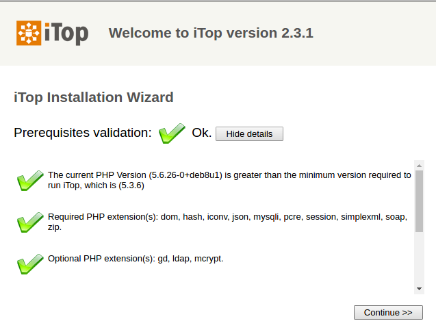
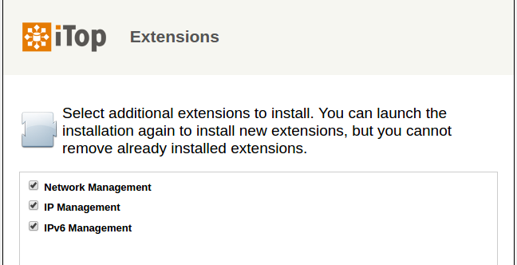
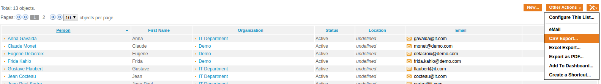

iTop
==============================

What is it ?
-----------------------------

iTop (IT Operational Portal) est un système de CMDB (Configuration Management DataBase), Open Source, piloté par une application WEB.
Son but étant de gérer toute l'activité et les informations de son IT (CIs configuration items), en gardant les bonnes pratiques ITIL.

Il offre une modularité et une souplesse au niveau de la création de cette CMDB.
En plus d'implémenter bon nombre de modules très utiles comme :

* La Documentation son infrastructure
* La gestion de tickets
* La gestion d'IP (TeemIp)
* L'export/import des données facilement

Links
-----------------------------

### Official

* [combodo](http://www.combodo.com/)
* [commercial](http://www.combodo.com/IMG/pdf/combodoproductsdatasheetfr.pdf)
* [wiki](https://wiki.openitop.org/doku.php)
* [TeemIp](https://wiki.teemip.com/doku.php)
* [TeemIP_installation](https://wiki.teemip.com/doku.php?id=2_1:administrators:install-module)
* [download_iTop](https://sourceforge.net/projects/itop/?source=typ_redirect)
* [installation](https://wiki.openitop.org/doku.php?id=2_3_0:install:start)
* [API](https://wiki.openitop.org/doku.php?id=2_3_0:advancedtopics:rest_json)

### Tutos

* [mkdown wiki](https://github.com/adam-p/markdown-here/wiki/Markdown-Cheatsheet)

How it works ?
-----------------------------

iTop est écrit en php et jabascript essentiellement et nécessite l'installation d'une base de données et d'un serveur Web tout simplement.
Il s'appui sur Graphviz pour la visualisation du cycle de vie des objets.

Installation
-----------------------------

### Prérequis Debian

Pour le Frontend :

    php_version="7.0"
    apt-get install apache2
    apt-get install php${php_version} php${php_version}-mysql php${php_version}-ldap php${php_version}-mcrypt php${php_version}-cli php${php_version}-soap php${php_version}-json graphviz php${php_version}-gd php${php_version}-zip php${php_version}-xml
    apt-get install mariadb-client

Pour le Backend :

    apt-get install mariadb-server

### iTop

Il faut configurer php et mysql avant l'installation d'iTop.

Télécharger la dernière archive sur:

[sourceforge](http://sourceforge.net/projects/itop/files/itop/)

Créer ensuite un vhost avec l'archive dézipée (ou la placer à la racine de /var/www)
Donner les droits à l'utilisateur www-data

    unzip iTop-*.zip
    mv web /var/www/itop
    chown -R www-data: /var/www/itop

Ne pas oublier de configurer son vhost en conséquence.  

!!! note 
    Voir la partie configuration pour la partie php et mysql.

Et démarrer les services :

    service apache2 start
    service mysql start

Rendez vous sur http://@IP_monHOST/monVhost
et suivre les instructions :

### TeemIP

TeemIP est une extension d'iTop.
Il permet de gérer les IP de son parc informatique.

A noter que TeemIP peut être installé en standalone.
Nous allons voir ici comment l'installer en tant que module :

Télécharger le module :

[module_TeemIP_2.0.1](http://sourceforge.net/projects/teemip/files/teemip%20-%20an%20iTop%20module/2.0.1/TeemIp-Module-2.0.1.zip/download)

Copier le contenu du fichier zip dans web/extensions

    unzip TeemIp-Module-2.0.1.zip
    cp -R web/extensions/* /var/www/itop/extensions
    ls -1 /var/www/itop/extensions

    readme.txt
    teemip-config-mgmt-adaptor
    teemip-ip-mgmt
    teemip-ipv6-mgmt
    teemip-network-mgmt
    teemip-storage-mgmt-adaptor
    teemip-virtualization-mgmt-adaptor

S'assurer que le fichier '/var/www/itop/conf/production/config-itop.php' puisse être réecrit.

    chmod +w /var/www/itop/conf/production/config-itop.php

Accéder ensuite à l'url suivante :

    http://<your_itop_root>/setup

Et suivre les instruction pour une 'upgrade'.
Les champs sont normalement pré-remplis.
Il faudra selectionner les nouveaux modules via le panneau extensions :

Configuration
-----------------------------

### PHP & MySQL

    vim /etc/php5/apache2/php.ini

      file_uploads = On                   #Activation de l'upload
      upload_tmp_dir = /tmp/upload        #Dossier temporaire contenant les fichiers uploadé (rw)
      upload_max_filesize = 100M          #Taille max d'un fichier uploadé
      max_file_uploads = 20               #Nombre max de fichier pouvant être uploadé avec une requête.
      post_max_size = 118M                #Taille max d'un POST > upload_max_filesize
      memory_limit = 300M                 #Mémoire alloué pour php > post_max_size
      max_input_time = 600                #Temps max autorisé pour la lecture de l'entrée standard.

    vim /etc/mysql/my.cnf

      max_allowed_packet      = 120M      #Taille d'une requête autorisée > upload_max_filesize
      bind-address            = 127.0.0.1 #A changer si le backend est sur une autre machine

    service mysql start

Note sur les différentes limites configurée :

    upload_max_filesize [php.ini] < post_max_size [php.ini] < max_allowed_packet [my.cnf] < memory_limit [php.ini]

Ne pas oublier de rajouter les droits pour l'hôte itop si la base est sur un autre host :

    mysql -uroot -p

      GRANT ALL PRIVILEGES ON *.* TO 'root'@'172.17.0.4' IDENTIFIED BY 'password' WITH GRANT OPTION;
      SELECT User, Host FROM mysql.user;

Créer le dossier d'upload temporaire :

    mkdir /tmp/upload
    chown -R www-data: /tmp/upload/

### iTop

Si l'on déplace les fichiers, attention aux liens générés dans la conf:

    vim /var/www/itopdemo/conf/production/config-itop.php

      'app_root_url' => 'http://@IP/path/',

#### Routines de maintenance (Background Tasks)

iTop fait tourner plusieurs routines de maintenance pour que le système fonctionne correctement.
Comme par exemple le contrôle des SLA sur les tickets.

Ces tâches sont écritent dans :

    webservices/cron.php

Il faut veuillez à ce qu'elles soient activées :

    vim /etc/cron.d/itop

      */5 * * * * root /usr/bin/php /var/www/html/itop/webservices/cron.php --param_file=/etc/itop/params >>/var/log/itop-cron.log 2>&1

Manipulations
-----------------------------

### Ordre d'implémentation des objets

Faire un tour sur le guide d'implémentation pour comprendre les différentes CI et leur ordre :
[implementation_guide](https://wiki.openitop.org/doku.php?id=2_3_0:implementation:start)

Il y a une notion de dépendance entre objets.

### Import/Export CSV

Une des forces d'Itop et de proposer l'import/export des données sous forme de .csv.

Pour exporter des données, on peut le faire au niveau de chaque type d'objet,
via le bouton "outils".

Par Exemple on peut selectionner les objets de type personnes, puis a droite, cliquer sur outils (le dessin) et selectionner l'export.

En ce qui concerne l'import, on le fera via la catégorie "Administration des données/import CSV".
On peut importer un fichier, copier/coller des données et afficher le modèle de données d'un type d'objet.

/!\ Attention, les modèles exportés ne sont pas forcement pareil que les modèles importés.

### Audits

### API

### Gestion des tickets

### Relancer une installation / charger un datamodel :

**Copier les fichiers delta du data model :**

    /var/www/itop/data/production.delta.xml
    /var/www/itop/data/production-modules

**Mettre les droits d'écriture sur le setup :**

    chmod 755 /var/www/itop/conf/production/config-itop.php

**Relancer le setup :**

    http://itop.foo/setup

Issues
-----------------------------

### Erreur 500 lors de l'accès à la page index.php

#### Message d'erreur :

    Class 'DBBackup' not found

##### Résolution :

1. Installation du package php-zip
2. Redémarrage du service apache2

#### Message d'erreur :

    PHP Fatal error:  Class 'DOMDocument' not found

##### Résolution :

1. Installation du package php-php-fdomdocument (normalement le package php7.0-xml devrait faire l'affaire).
2. Redémarrage du service apache2
