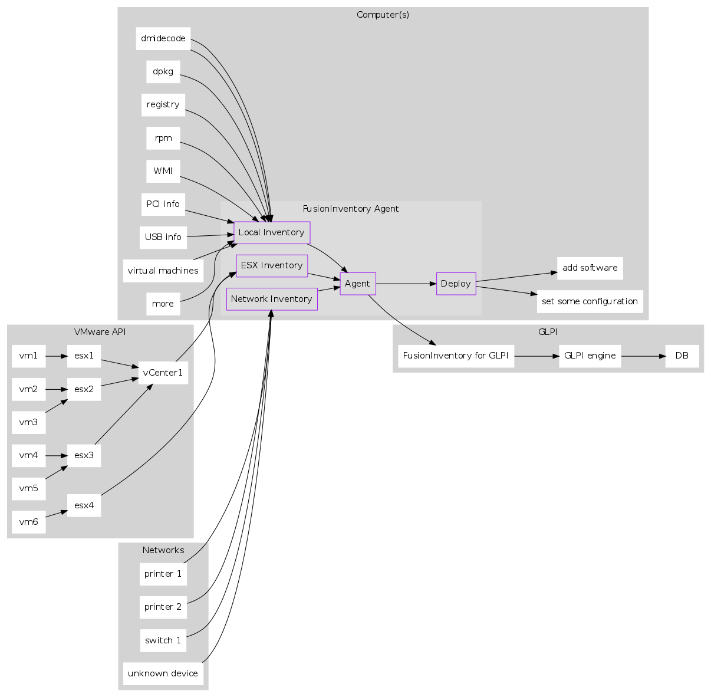

FusionIventory
==============================

What is it ?
-----------------------------

Fusion Inventory est un outils d'inventaire de parc informatique.  
Inspiré d'OCS Inventory, il permet de collecter des données sur un noeud (via un agent) et de les envoyer directement sur GLPI par l'intérmédiaire d'un plugin.

Links
-----------------------------

### Official

* [site officiel](http://fusioninventory.org/)
* [documentation](http://fusioninventory.org/documentation/)
* [Sur Github](https://github.com/fusioninventory)
* [sources agent github](https://github.com/fusioninventory/fusioninventory-agent)

How it works ?
-----------------------------

Fusion Inventory est écrit en Perl et se base principalement sur un ensemble de module Perl pour récupérer des informations sur les noeuds monitorés.

### Diagram officiel

Installation
-----------------------------

### Debian/ubuntu

* [Install debian](http://fusioninventory.org/documentation/agent/installation/linux/deb.html)

#### Depuis les sources

##### Installation des dépendances

    apt-get -y install wget dmidecode nmap make hwdata
    apt-get -y install perl perl-modules libmodule-build-perl libmodule-install-perl
    apt-get -y install libfile-which-perl libfile-copy-recursive-perl libuniversal-require-perl
    apt-get -y install libtest-http-server-simple-perl libhttp-server-simple-authen-perl libhttp-proxy-perl
    apt-get -y install libio-capture-perl libipc-run-perl libnet-snmp-perl libnet-telnet-cisco-perl
    apt-get -y install libtest-compile-perl libtest-deep-perl libtest-exception-perl
    apt-get -y install libtest-mockmodule-perl libtest-mockobject-perl libtest-nowarnings-perl
    apt-get -y install libxml-treepp-perl libproc-daemon-perl libproc-pid-file-perl
    apt-get -y install libparallel-forkmanager-perl libnet-ip-perl libparse-edid-perl
    apt-get -y install libdigest-sha-perl libtext-template-perl libsocket-getaddrinfo-perl

##### Récupération de l'archive

    wget https://github.com/fusioninventory/fusioninventory-agent/releases/download/2.3.20/FusionInventory-Agent-2.3.20.tar.gz
    tar xvzf FusionInventory-Agent-2.3.20.tar.gz
    cd FusionInventory-Agent-2.3.20

##### Build et install

    perl Makefile.PL
    make
    make install

#### Depuis les packages

    echo "deb http://httpredir.debian.org/debian wheezy-backports main" >> /etc/apt/sources.list
    apt-get update

    apt-get install libnet-cups-perl
    apt-get install -t wheezy-backports fusioninventory-agent

    apt-get install fusioninventory-agent-task-network
    apt-get install fusioninventory-agent-task-esx
    apt-get install fusioninventory-agent-task-deploy

Configuration
-----------------------------

### Agent

Fichier de conf dans **/usr/local/etc/fusioninventory/agent.cfg** pour l'install via les sources.  
ou **/etc/fusioninventory/agent.cfg** avec l'install par paquets.

Il faudra y définir un target au minimum :

    local = /tmp
 

#### Configuration du service

**/etc/systemd/system/fusioninventory-agent.service**

    [Unit]
    Description=FusionInventory agent
    After=syslog.target network.target
     
    [Service]
    ExecStart=/usr/local/bin/fusioninventory-agent --daemon --no-fork
     
    [Install]
    WantedBy=multi-user.target

Activation su service :

    systemctl enable fusioninventory-agent

Démmarage du service :

    systemctl start fusioninventory-agent

Manipulations
-----------------------------

Troubleshooting
-----------------------------

### Erreur "Permission denied" avec un conteneur lxc

#### Log
    
    Failed to reset devices.list: Operation not permitted

#### Description

Problème de droits avec un conteneurs lxc

#### Résolution

Rajouter dans la config du conteneur :

**/var/lib/lxc/mon_ct/config**

    lxc.cgroup.devices.allow               = a
