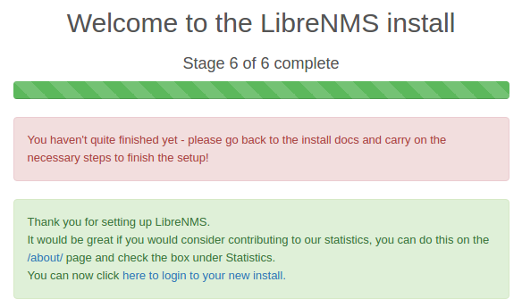

LibreNMS
==============================

What is it ?
-----------------------------

LibreNMS est un outil de supervision PHP/MySQL/SNMP orienté réseau.
Il supporte bon nombre de protocoles réseaux et dispose de fonctionnalitées d'auto-découverte.
Il se base sur SNMP pour ajouter des hôtes à superviser automatiquement.

Links
-----------------------------

### Official

* [Documentation](http://docs.librenms.org/)

### Tutos

* [Un petit Lab sur librenms](https://nsrc.org/workshops/2015/ripe-nsrc-nmm/raw-attachment/wiki/Agenda/librenms-lab-1.htm)

How it works ?
-----------------------------

LibreNMS est constitué de trois outils :

* Un service WEB pour lancer son interface
* Des scripts PHP à executer pour sonder le réseau et récupérer les informations
* Une base MySQL pour la configuration de LibreNMS
* Une base RRD pour la récupération des informations des noeuds supervisés.

Mécanisme d'auto-découverte :

1. LibreNMS utilise une méthode d'auto-découverte (ARPing, SNMP-scan ...) pour identifier des hôtes.
2. LibreNMS tente une connexion sur l'hôte via SNMP.
3. Si la connexion réussie, il l'ajoute en tant qu'hôte à superviser.

Installation
-----------------------------

### Base de données

On install les packages :

    apt-get install mariadb-server mariadb-client
    service mysql restart

On Créer la base et l'utilisateur :

    mysql -uroot -p

<!-- vim -->

    CREATE DATABASE librenms;
    GRANT ALL PRIVILEGES ON librenms.*
      TO 'librenms'@'localhost'
      IDENTIFIED BY '<password>'
    ;
    FLUSH PRIVILEGES;
    exit

**vim /etc/mysql/mariadb.conf.d/50-server.cnf**

    [mysqld] 
    ...
    innodb_file_per_table=1
    sql-mode=""

Puis on redémarre le service :

    service mysql restart

### Serveur WEB

Les packages :

    apt-get install php7.0-cli php7.0-mysql php7.0-gd php7.0-snmp php-pear php7.0-curl php7.0-fpm \
    snmp graphviz php7.0-mcrypt php7.0-json nginx-full fping imagemagick whois mtr-tiny nmap \
    python-mysqldb snmpd php-net-ipv4 php-net-ipv6 rrdtool git

Configurer les timezones :

[Liste des timezones](http://php.net/manual/en/timezones.php)

Pour ces deux fichiers :

* **/etc/php/7.0/fpm/php.ini**
* **/etc/php/7.0/cli/php.ini**

    [Date]
    #date.timezone = Europe/Paris
    #ou
    date.timezone = UTC

On redémarre le service :

    service php7.0-fpm restart
    phpenmod mcrypt

### LibreNMS

Création du user :

    useradd librenms -d /opt/librenms -M -r
    usermod -a -G librenms www-data

Clone du repo :

    cd /opt
    git clone https://github.com/librenms/librenms.git librenms

Créer le socle pour la base rrd :

    cd /opt/librenms
    mkdir rrd logs
    chmod 775 rrd

Créer le vhost pour librenms (interface web) :

**/etc/nginx/conf.d/librenms.conf**

    server {
     listen      80;
     server_name librenms.local;
     root        /opt/librenms/html;
     index       index.php;
     access_log  /opt/librenms/logs/access_log;
     error_log   /opt/librenms/logs/error_log;
     location / {
      try_files $uri $uri/ @librenms;
     }
     location ~ \.php {
      include fastcgi.conf;
      fastcgi_split_path_info ^(.+\.php)(/.+)$;
      fastcgi_pass unix:/var/run/php/php7.0-fpm.sock;
     }
     location ~ /\.ht {
      deny all;
     }
     location @librenms {
      rewrite api/v0(.*)$ /api_v0.php/$1 last;
      rewrite ^(.+)$ /index.php/$1 last;
     }
    }

Rendez vous sur la page **http://librenms.local/install.php**
et suivre les instructions.

Il vous invitera surement à éditer le fichier **/opt/librenms/config.php** en fournissant son contenu.

### SNMPD

    cp /opt/librenms/snmpd.conf.example /etc/snmp/snmpd.conf

Changer le nom de communauté **RANDOMSTRINGGOESHERE** par le votre :

    vim /etc/snmp/snmpd.conf

Script de detection de distro

    curl -o /usr/bin/distro https://raw.githubusercontent.com/librenms/librenms-agent/master/snmp/distro
    chmod +x /usr/bin/distro

On redémarre le service :

    service snmpd restart

### CRON

    cp /opt/librenms/librenms.nonroot.cron /etc/cron.d/librenms

### Droits

    chown -R librenms:librenms /opt/librenms

### Contrôle de l'installation

    cd /opt/librenms
    ./validate.php

Configuration
-----------------------------

### Optimisation

TODO

### Auto Découverte

L'un des atouts majeur de cette solution est l'auto découverte.
Elle peut se faire via plusieurs méthodes :

* CDP
* FDP
* LLDP
* OSPF
* BGP
* SNMP
* ARP

Pour activer/désactiver les modules de discovery, il faut éditer **config.php**.

!!! Note
    LibreNMS se base sur SNMP pour pouvoir ajouter un hôte à superviser.

#### Configurer SNMP :

Pour les v1 et 2 :

    $config['snmp']['community'][0] = "public";
    $config['snmp']['community'][2] = "other_community";

Pour la v3

    $config['snmp']['v3'][0]['authlevel'] = "noAuthNoPriv";  # noAuthNoPriv | authNoPriv | authPriv
    $config['snmp']['v3'][0]['authname'] = "root";           # User Name (required even for noAuthNoPriv)
    $config['snmp']['v3'][0]['authpass'] = "";               # Auth Passphrase
    $config['snmp']['v3'][0]['authalgo'] = "MD5";            # MD5 | SHA
    $config['snmp']['v3'][0]['cryptopass'] = "";             # Privacy (Encryption) Passphrase
    $config['snmp']['v3'][0]['cryptoalgo'] = "AES";          # AES | DES

#### Ajouter les réseaux à manager :

    $config['nets'][] = "192.168.0.0/24";

#### Modules d'auto-decouverte

[Voir tous les modules d'auto-découverte](http://docs.librenms.org/Support/Discovery%20Support/#discoveryphp)

##### ARP :

    $config['discovery_modules']['discovery-arp'] = 1;

##### OSPF

Activé par défaut :

    $config['autodiscovery']['ospf'] = false;

##### BGP

Activé par défaut :

    $config['autodiscovery']['bgp'] = false;

#### Affichage/Informations

##### Ajouter les hôtes par leur IP (pas de reverse DNS pour chercher le nom)

    $config['discovery_by_ip'] = true;

##### Rajouter le nom de domaine :

    $config['mydomain'] = 'example.com';

##### Ajouter la possibilité d'avoir des noms d'hôtes dupliqués

    $config['allow_duplicate_sysName'] = true;

### Services Nagios

Il est possible d'implémenter des checks Nagios directement sur les hôtes ciblés.
Pour cela on va ajouter la base de checks, puis manuellement ciblé un hôte pour lui attribuer un service.

Install des packages :

    sudo apt-get install nagios-plugins
    ls /usr/lib/nagios/plugins

Activation du module de services :

**/opt/librenms/config.php**

    $config['show_services'] = 1;
    $config['nagios_plugins'] = "/usr/lib/nagios/plugins";

On s'assure que le check_services.php soit activé au niveau de la crontab : **/etc/cron.d/librenms**

    */5  *    * * *   librenms    /opt/librenms/check-services.php >> /dev/null 2>&1

Sur l'interface, rafraichir la page et aller dans l'onglet **Services**.

Il est possible de selectionner le device depuis lequel va être executer le service (celui qui execute le check)
Ainsi que le type de contrôle à effectuer (le check à effectuer).
Enfin il ne restera plus qu'à reseigner la cible du test et les paramètres du check.

!!! Note
    N'oubliez pas de renseigner la description sous peine de ne plus s'y retrouver par la suite.

### Smoke_Ping

### Network Map

### Influx DB

### Alertes

#### Mail

#### IRC

Manipulations
-----------------------------

### Sondes (Polling)

Pour forcer les pollers à récupérer les informations sur les hôtes :

    /opt/librenms/poller.php -h all

### Auto-découverte (Discovery)

!!! Note
    Pour que l'auto-découverte puisse fonctionner, il faut au moins ajouter un hôte (localhost par exemple)

L'auto découverte est lancé par défaut toutes les 6h via la crontab.
Pour la lancer automatiquement :

    /opt/librenms/discovery.php -h all
    /opt/librenms/discovery.php -h new

### Initialiser un mot de passe

Pour se faire, on créera un nouvel utilisateur avec les droits d'admin que l'on pourra re-supprimer par la suite :

    /opt/librenms/adduser.php mon_user mon_password 10

Troubleshooting
-----------------------------

### Erreur, des type de timezon différent entre le système et PHP : 

Message :

    [FAIL]  You have a different system timezone (UTC) specified to the php configured timezone (CET), please correct this.

Petit script de test **/tmp/test.php**

    #!/usr/bin/env php
    <?php

    $ini_tz = ini_get('date.timezone');
    $sh_tz = rtrim(shell_exec('date +%Z'));
    $php_tz = date('T');

    echo "$ini_tz \n";
    echo "$sh_tz \n";
    echo "$php_tz \n";

    ?>

Résolution :

Si votre système est en mode UTC, il suffit de renseigner le champ **date.timezone = UTC** au niveau des fichiers php :

### Insérer des hôtes non SNMP

Il semble que cette fonctionnalitée ne soit pas encore intégrée (ou ne le sera pas)

[Voir le thread sur ce sujet](https://github.com/librenms/librenms/issues/1767)
