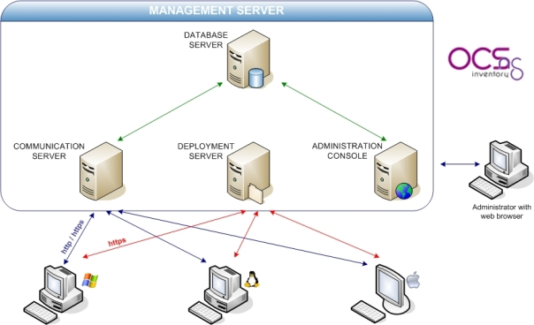

OCS Inventory NG
==============================

What is it ?
-----------------------------

OCS Inventory NG pour " Open Computer and Software Inventory Next Generation" est un outil de création d'inventaire de parc informatique.  
Il fonctionne sur le modèle d'agents et d'un serveur central stockant toutes les informations du parc.

### Main features

* Centralisation des données du parc
* mode agent
* compatible multi-OS
* Format de données XML
* Envoi des données over HTTP (module apache)
* Traitement des données en Perl
* Stockage en base MySQL
* IPdiscover : Découverte réseau (par l'intermédiaire des agents)
* scan SNMP
* S'interface facilement
* Dispose d'une API [web_services](http://wiki.ocsinventory-ng.org/index.php?title=Developers:Web_services)
* Plugins : création de collecteur de données (via l'API)
* Télédiffusion (déploiement de logiciels/scripts)
* WUI
* Synchro avec GLPI ou même iTop

 

Links
-----------------------------

### Official

* [site officiel](https://www.ocsinventory-ng.org/fr/)
* [Wiki](http://wiki.ocsinventory-ng.org/index.php?title=Main_Page)
* [Documentation](http://wiki.ocsinventory-ng.org/index.php?title=Documentation:Main#OCS_Inventory_NG_2.x_Documentation)
* [IP discover](http://wiki.ocsinventory-ng.org/index.php?title=Documentation:Ipdiscover)
* [GitHub](https://github.com/OCSInventory-NG)

How it works ?
-----------------------------

Workflow :

    Raw data -> XML formatting -> sending in HTTP or HTTPS in /ocsinventory -> handling with mod_perl on the fly -> DB mysql

### Composants d'OCS

1. Serveur de base de données : Stockage des information (mysql)
2. Serveur de communication : Sert les requêtes entre les agents et la base de données (via Apache + perl et mod_perl)
3. Console d'administration (WUI Apache + PHP)
4. Serveur de déploiement : stocke les configurations (Apache + ssl)

Installation
-----------------------------

### Debian 

#### Serveur de communication

    apt-get install libxml-simple-perl
    apt-get install libcompress-zlib-perl
    apt-get install libdbi-perl
    apt-get install libdbd-mysql-perl
    apt-get install libapache-dbi-perl
    apt-get install libnet-ip-perl
    apt-get install libsoap-lite-perl

    #Pour éviter un "make -- NOT OK" lors de la commande cpan :
    apt-get install build-essential autoconf automake libtool gdb
    cpan -i XML::Entities

#### Console d'admin

    apt-get install php-pclzip

    #Note : le paquet php5-gd n'existait pas pour la version stretch, rajouter donc wheezy à votre liste de dépôt :
    #deb [arch=amd64] http://httpredir.debian.org/debian          wheezy         main
    #Puis le désactiver.

    apt-get install php5-gd

#### Service de gestion

    

Configuration
-----------------------------

Manipulations
-----------------------------

Troubleshooting
-----------------------------

### Erreur

#### Log

    log output

#### Description

#### Résolution

