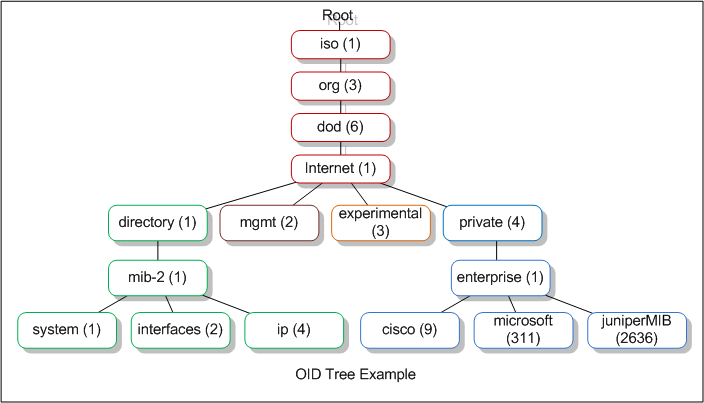

S N M P 
==============================

What is it ?
-----------------------------

SNMP (Simple Network Management Protocol) est un protocol permettant de stocker et d'envoyer des informations sur l'état d'un système.

Links
-----------------------------

### Official

* [Net SNMP wiki](http://net-snmp.sourceforge.net/wiki/index.php/Main_Page)
* [Apprendre SNMP avec le python (très bien détaillé)](https://makina-corpus.com/blog/metier/2016/initiation-a-snmp-avec-python-pysnmp)
* [Un site bien expliqué](https://www.manageengine.com/network-monitoring/what-is-snmp.html)

### Tutos

* [Très bon tuto d'install et de configuration d'SNMP](https://www.digitalocean.com/community/tutorials/how-to-install-and-configure-an-snmp-daemon-and-client-on-ubuntu-14-04)
* [SNMP Debian](https://wiki.debian.org/SNMP)
* [SNMP ubuntu fr](https://doc.ubuntu-fr.org/snmp)
* [SNMP monitoring-fr](https://wiki.monitoring-fr.org/supervision/snmp)
* [TRAP SNMP](http://www.sugarbug.web4me.fr/atelier/techniques/monitoring_lan/snmp/traps/)
* [TRAP SNMP + SNMPTT](http://xavier.dusart.free.fr/nagios/snmptraps.html)

### Voir aussi

* [WMI l'implémentation de Microsoft](https://fr.wikipedia.org/wiki/Windows_Management_Instrumentation)
* [ASN - le langage de description des MIB](https://fr.wikipedia.org/wiki/ASN.1)
* [Linux OID disponibles](http://www.debianadmin.com/linux-snmp-oids-for-cpumemory-and-disk-statistics.html)

How it works?
-----------------------------

### Dans les grandes lignes :

SNMP est un protocole réseau permettant de récupérer (ou d'écrire) de l'information sur des agents.
Son but a été de normaliser l'accès aux informations pour tous les constructeurs.
L'information correspond à une base d'OIDs formant un groupe clé-valeur.  
Chaque OID est unique, et chaque constructeur dispose de son propre préfix.  
Pour comprendre les données relatives aux OIDs, des MIB sont mises à disposition au format txt.  
Un serveur Manager interogera des Agents pour récupérer ses informations.

### Ports par défaut

SNMP fonctionne, par défaut, over UDP sur le port 161 de l'agent (pour les requêtes clientes)  
et le port 162 pour les TRAP SNMP.

### Architectures

Basiquement, un Manager (client) requête des Agents pour obtenir des informations sur leur état.

#### Agent :

* Collecte les données de son environnement.
* Stocke les informations dans une base de données selon la description de la MIB
* Peut signaler des événements au Manager (Trap)
* Peut faire office de proxy SNMP pour des équipements non compatibles SNMP

#### Manager (NMS) :

* Obtient des informations auprès des agents (GET)
* Peut écrire des données sur les agents (SET)
* Reception des TRAP SNMP
* Acquittement des INFORM SNMP

### Modes de récupération d'information

* Mode polling

Le client (Manager) inrérroge le serveur (Agent) pour obtenir des OIDS d'une MIB.

* Mode trap

Le serveur (Agent) envoi un trap SNMP à un autre Agent pour lui envoyer des informations.

### Versions

* SNMP v1 (RFC 1155, 1157 et 1212).
* SNMP v2c (RFC 1901 à 1908).
* SNMP v3 (RFC 3411 à 3418).

SNMP (v1 et v2) utilisent, en clair, un nom de communauté (souvent public ou private) comme mot de passe pour determiner les droits à endosser lors des requêtes clientes.

Il est préférable d'utiliser la v3 pour éviter ce genre de problème avec l'intégration du chiffrement du nom de communauté.

* [Sécuriser SNMP](http://net-snmp.sourceforge.net/wiki/index.php/TUT:Security)

### OID (Object ID)

Chaque OID est unique par contructeur (un préfix est donné).
Ces préfix s'obtiennent auprès de [l'iana (Internet Assigned Numbers Authority).](http://pen.iana.org/pen/PenApplication.page)

Exemple d'OID (forme numerique non traduite) :

    1.3.6.1.4.868.2.4.1.2.1.1.1.3.3562.3 

Les OID sont donc organisés en arbre.

Les valeurs d'un OID, peuvent être une seule donnée ou un tableau de données.

### MIB (Management Information Base)

La MIB est une base de données virtuelle permettant d'organiser l'information disponible uniquement lorsque l'Agent est démarré.
Les MIB sont des collections de définitions d'OIDs. 
Elles décrivent, au format texte (ASN), comment accéder à l'information.

Exemple d'OID après traduction :

    .iso.org.dod.internet.mgmt.mib-2.system.sysServices.0

Version simplifiée (en indiquand la MIB) :

    SNMPv2-MIB::sysServices.0

!!! note
    Pour que le manager puisse traduire les OID, il doit, lui aussi avoir ses descriptions de MIB à jour.  
    
!!! warning
    En fonction des constructeurs, l'implémentation des MIB peut être différente (où sont stocké les données ...).
    Les données peuvent être volatiles, c'est à dire non stockées en dur et récupérer uniquement au moment d'une requête du manager.
    C'est aussi un des avantages de ce standard.

#### La MIB-2, la plus connue (RFC 1213).

* [Description de la RFC 1213 pour la MIB-2](https://tools.ietf.org/html/rfc1213)

Mise en oeuvre par quasiment tous les équipements TCP/IP :

Avec les OID classés dans dix groupes principaux :

* system
* interfaces
* Address Translation
* IP
* ICMP
* TCP
* UDP
* EGP
* transmission
* SNMP

#### Comprendre la description d'une MIB

Exemple :

    ifDescr OBJECT-TYPE
     SYNTAX DisplayString (SIZE (0..255))
     ACCESS read-only
     STATUS mandatory
     DESCRIPTION
     "A textual string containing information about the
     interface. This string should include the name of
     the manufacturer, the product name and the version
     of the hardware interface."
     ::= { ifEntry 2 }

Avec :

* ifDescr : son nom
* DisplayString : son type
* read-only : son mode d'accès
* STATUS mandatory : son état
* ::= { ifEntry 2 } : son emplacement dans le noeud parent (2ème sous-éléments du noeud "ifEntry")

### TRAPS

SNMPD peut être configuré pour envoyer des traps SNMP au lieu d'attendre une requête cliente.
Les TRAP sont envoyés, à chaque événements du système (configurés au niveau de l'agent), sur le Manager.

Le Manager sera en mesure de traiter le message grâce à un service (ex : snmptrapd) et d'appliquer des filtres (ex : snmptt).

#### SNMPTT

* [SNMPTT en détail](http://snmptt.sourceforge.net/about.shtml)
* [SNMPTT FORMAT](http://snmptt.sourceforge.net/docs/snmptt.shtml#SNMPTT.CONF-FORMAT)

SNMPTT (Trap Translator) a été écrit en Perl pour fonctionner avec snmptrapd.
Il permet de lire un spool de trap afin de créer et formatter des messages pour de mutiples destinataires possibles (Syslog, Base SQL, Emails, Programme externe...)

La liste des Trap gérée par SNMPTT est définie selon les éléments suivant (dans /etc/snmp/snmptt.conf) :

    EVENT Nom_de_l'event son_OID "sa_catégorie" son_niveau_de_séverité
    FORMAT Message_de_log (avec la possibilité d'utiliser les variables prédéfinies)
    EXEC Commande à executer (avec la possibilité d'utiliser les variables prédéfinies)
    #Et plein d'autres possibilités avec PREEXEC, NODES, MATCH, REGEX
    SDESC
    La description du TRAP entre ces deux balises.
    sur plusieurs lignes.
    EDESC

Installation
-----------------------------

### Agent

    apt-get install snmpd

### Manager (Client)

Client SNMP :

    apt-get install snmp snmp-mibs-downloader libsnmp-dev

Pour la réception des TRAP :
  
    apt-get install snmptrapd

Pour Filtrer les TRAP :

    apt-get instal snmptt

### Visionneur de MIB graphique :

    apt-get install tkmib

Configuration
-----------------------------

### Agent

**/etc/snmp/snmpd.conf**

    #Écouter sur toutes les interfaces :
    agentAddress udp:161,udp6:[::1]:161

    #Gérer les vues (quelles informations une communauté pourra requêter)
    view   all         included   .1
    view   systemonly  included   .1.3.6.1.2.1.1
    view   systemonly  included   .1.3.6.1.2.1.25.1

    #Gérer les communautés et les accès aux vues
    rocommunity public  default    -V systemonly
    rocommunity private  default    -V all

**/etc/defaul/snmpd**

    #Intégrer les MIBs:
    export MIBS=ALL
    export MIBDIRS=/usr/share/snmp/mibs

#### Configurer l'envoi d'un TRAP SNMP

Rajouter le serveur qui récupéra les données et la communauté utilisée (ex pour SNMP v1) :

**/etc/snmp/snmpd.conf**

    #Activation de l'envoi des traps sur le manager
    trapsink mon_server_manager public

    #Choix des events déclanchant un trap:
    defaultMonitors yes
    linkUpDownNotifications yes

### Client

**/etc/snmp/snmp.conf**

    #commentez la ligne 'mibs'
    #mibs :

Mettre à jour les MIBs :

    download-mibs

#### Configurer la réception d'un TRAP SNMP

**/etc/default/snmptrapd**

    TRAPDRUN=yes

    # snmptrapd options (use syslog).
    TRAPDOPTS='-Lsd -p /run/snmptrapd.pid'

**/etc/snmp/snmptrapd.conf**

    #Activer les communautés pouvant recevoir des informations
    authCommunity log,execute,net private　
    authCommunity log,execute,net public

Puis redémarrer le daemon :

    service snmptrapd restart

Il est possible de constater l'envoi de trap en redémarrant le service snmp sur l'agent et contrôle son fichier de log.

Exemple :

    tail -f /var/log/syslog

    Mar 12 19:56:32 icinga2 snmptrapd[16280]: 2017-03-12 19:56:32 192.168.0.24(via UDP: [192.168.0.24]:45713->[192.168.0.29]:162) TRAP, SNMP v1, community public#012#011NET-SNMP-MIB::netSnmpNotificationPrefix Enterprise Specific Trap (NET-SNMP-AGENT-MIB::nsNotifyShutdown) Uptime: 0:00:27.93
    Mar 12 19:56:32 icinga2 snmptrapd[16280]: 2017-03-12 19:56:32 192.168.0.24(via UDP: [192.168.0.24]:39562->[192.168.0.29]:162) TRAP, SNMP v1, community public#012#011NET-SNMP-MIB::netSnmpAgentOIDs.10 Cold Start Trap (0) Uptime: 0:00:00.08

#### Filtrer les traps avec SNMPTT

1. Interfacer SNMPTT avec SNMPTRAPD
2. Charger les MIB des constructeurs au format SNMPTT
3. Redémarrer les services

##### Interfaçage avec snmptrapd :

**/etc/snmp/snmptrapd.conf**
      
    #On utilisera systématiquement snmptt pour gérer nos TRAPs
    traphandle default /usr/sbin/snmptt

    #On accepte toutes les TRAPs
    disableAuthorization yes

    #On laisse les logs à la charge de SNMPTT
    donotlogtraps  yes

**/etc/default/snmptrapd**

    #Désactivation de l'interprétation des OID pour le laisser à la charge de SNMPTT
    TRAPDOPTS='-On -Lsd -p /run/snmptrapd.pid'

Manipulations
-----------------------------

### Tester l'accès à une MIB :

#### snmpwalk

Pour obtenir des informations en lot :

    snmpwalk -v VERSION_SNMP -c COMMUNITY @IP_HOST [OID_PREFIX]

Exemple:

    snmpwalk -v 1 -c public 10.10.1.254 .1

#### snmpget

Pour obtenir les informations sur un OID précis.

Exemple :

    snmpget -v1 -c public 127.0.0.1 OID

#### snmptranslate 

**Afficher les paths dans lesquels seront lus les MIB :**

    snmptranslate -Dinit_mib .1.3 2>&1 |grep MIBDIR

Équivaut à :

    net-snmp-config --default-mibdirs

Traduire un OID ou inversement.

Exemples :

    snmptranslate .1.3.6.1.6.3.1.1.5.1
    snmptranslate -On NET-SNMP-MIB::netSnmpAgentOIDs.10

### Charger une MIB

* [Tuto sur l'utilisation d'une MIB en local](http://net-snmp.sourceforge.net/wiki/index.php/TUT:Using_and_loading_MIBS)

La MIB permet de rendre compréhensible un trap SNMP.
Pour la charger, il faut la placer dans un des paths renvoyé par la commande 

    snmptranslate -Dinit_mib .1.3 2>&1 |grep MIBDIR

!!! note
    Notez qu'il peut y avoir des dépendances entre MIB.  
    Dans ce cas il faudra téléchager les MIB manquante.

Une fois que la MIB et ses dépendances sont dans les bon PATH, on peut effectuer nos traductions en l'incluant avec l'option -m

Exemple avec la MIB "CISCO-RHINO-MIB" :

    snmptranslate -m +CISCO-RHINO-MIB -IR -On ciscoLS1010ChassisFanLed

ou sous une autre forme :

    snmptranslate -On CISCO-RHINO-MIB::ciscoLS1010ChassisFanLed

Si on ne veut pas avoir besoin de les lire à chaque appel de nos commandes, il faut les ajouter à la configuration :

Via la variable d'environnement :

    MIBS=+CISCO-RHINO-MIB:SOME-OTHER-SPIFFY-MIB
    export MIBS

Ou le fichier de conf **snmp.conf** :

    mibs +ALL

### Traps

#### snmptrad

Envoyer une trap à un manager

Exemples :

    snmptrap -v 1 -c public manager enterprises.spider test-hub 3 0 '' interfaces.iftable.ifentry.ifindex.1 i 1
    snmptrap -v 1 -c public 192.168.0.29 NET-SNMP-EXAMPLES-MIB::netSnmpExampleNotification "" 6 17 "" netSnmpExampleInteger i 123456

#### snmpttconvert

Pour faciliter l'écriture de la configuration SNMPTT,  
il est possible d'utiliser snmpttconvert pour comvertir des éléments d'une MIB dans le format de configuration de SNMPTT.

Exemple d'un TRAP non converti (ciscotrap.txt)

    rpsFailed {.1.3.6.1.4.1.437.1.1.3} 6 5 - "Status Events" 1
    Trap received from enterprise $E with $# arguments: sysName=$1
    SDESC
    "A redundant power source is connected to the switch but a failure exists in
    the power system."
    EDESC

Exemple d'un TRAP converti

    snmpttconvert ciscotrap.txt

    #
    #
    #
    EVENT rpsFailed .1.3.6.1.4.1.437.1.1.3.0.5 "Status Events" Normal
    FORMAT Trap received from enterprise $E with $# arguments: sysName=$1
    #EXEC qpage -f TRAP notifygroup1 "Trap received from enterprise $E with $# arguments: sysName=$1"
    SDESC
    "A redundant power source is connected to the switch but a failure exists in
    the power system."
    EDESC
