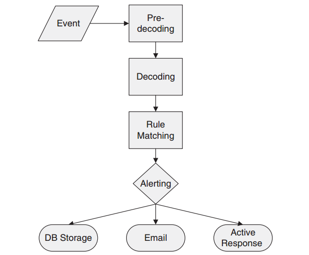
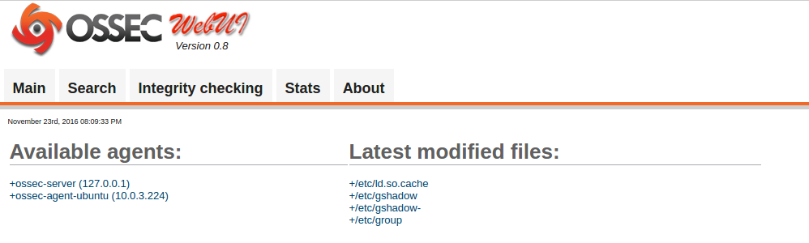

O S S E C  // W A Z U H
==============================

What is it ?
-----------------------------

OSSEC est un HIDS (Host-based Intrusion Detection System).
Il permet d'alerter et d'agir en fonction des intrusions détéctées.

Links
-----------------------------

**OSSEC :**

* [Site officiel](http://ossec.github.io/)
* [Documentation](http://ossec.github.io/docs/)
* [Téléchargement](http://ossec.github.io/downloads.html)
* [Sources](https://github.com/ossec/ossec-hids)
* [Tuto ubuntu-fr.org](https://doc.ubuntu-fr.org/ossec)
* [WUI](https://github.com/ossec/ossec-wui)
* [PDF Working with Rules](http://www.ossec.net/ossec-docs/OSSEC-book-ch4.pdf)

Avec les conf managers :

* [OSSEC et Saltstack](http://www.nineproductions.com/saltstack-ossec-state-using-reactor/)
* [OSSEC et Puppet](https://forge.puppet.com/wazuh/ossec/readme)
* [OSSEC et Ansible - agent ](https://github.com/dj-wasabi/ansible-ossec-agent)
* [OSSEC et Ansible - server ](https://github.com/dj-wasabi/ansible-ossec-server)

**Wazuh :**

* [Site offciel wazuh.com](http://www.wazuh.com/)
* [Documentation wazuh](http://documentation.wazuh.com/en/latest/index.html)
* [Sources wazuh](https://github.com/wazuh/wazuh)

**Voir aussi OSSIM :**

Un gestionnaire d'information de sécurité permetant d'ajouter de la corrélation de données...
Qui a l'air un peu pauvre en documentation.

* [OSSIM](https://www.alienvault.com/products/ossim)
* [OSSIM-IDS](https://www.alienvault.com/solutions/intrusion-detection-system)

How it works ?
-----------------------------

### OSSEC

OSSEC supervise l'activité du système en analysant les logs, effectuant des rootcheck et surveillant les process.
Il faut donc définir une base comportementale pour qu'OSSEC puisse lever une alerte.

#### Fonctionnalités :

* contrôle d'intégrité des fichiers [FIM - File Integrity Monitoring]
* analyse de log [log analysis / remote syslog]
* contrôle de registre [windows registry monitoring]
* alerte en temps réel [real-time alerting]
* detection de dissimulation d'activité [rootkit detection]
* réponse active, éxecuter une action pour des alertes spécifiées [trigger]

Il peut fonctionner en mode agent ou sans-agent pour les OS moins accessibles commes les équipements réseaux.

#### Langages :

OSSEC est composé d'une collection de modules écrit en C, de scripts bash, perl...

#### Architecture

OSSEC est décomposé en trois type de services :

* Manager (Centralise les bases d'intégrités, les logs ...) il écoute sur le port 1514 par défaut.
* Agent (Collecte l'information sur un hôte pour l'envoyer au Manager)
* Agentless (Permet de collecter des informations sur des OS plus fermés)

Voir la liste des OS supportés : [Systèmes supportés](http://ossec.github.io/docs/manual/supported-systems.html)

#### Workflow des alertes, règles et décodeurs.

##### Fonctionnement simple :

1. collecte de l'information en fonction des checks définis
2. analyse de l'information en fonction des règles définis
3. lever un alerte en cas de match avec une des régles implémentées.

##### Fonctionnement détaillé :

C'est un des mécanismes avancé d'OSSEC pour l'analyse de log.
Lorsqu'un log est remonté, plusieurs procédés sont appliqués :

**1.** OSSEC reçoit un évènement à traiter.

Exemple d'event :

    Apr 14 17:32:06 linux_server sshd[1025]: Accepted password for dcid from 192.168.2.180 port 1618 ssh2

**2.** OSSEC regarde si un pré-décodeur existe pour extraire et formater l'évènement. (en fonction du protocol utilisé).

Pré-décodeurs type :

* syslog
* ASL

**3.**. Il pré-décode l'évènement en ne gardant que le contenu static dans un tableau de correspondance,

Exemple de champs :

    hostname          linux_server
    program_name      sshd
    log               Accepted password for dcid from 192.168.2.180 port 1618 ssh2
    time/date         Apr 14 17:32:06

**4.** OSSEC décode le log (en fonction du program_name) 
pour y extraire les informations variables comme une adresse IP ...  
Et les stocks pour une autre phase d'analyse.

Exemple de champs :

    srcip             192.168.2.180
    user              dcid

**5.** OSSEC regarde si une règle correspond à l'évènement formatté pour lever une alerte.

Le but d'OSSEC est d'ordonnancer/automatiser des tâches de contrôles (checks) sur des hôtes.

#### Protocoles

Par défaut le manager écoute sur le port 1514.  
La communication avec les agents se fait via le protocol "OSSEC encrypted message".  
Pour la partie agentless, c'est ssh qui est utilisé.

#### Syscheck

Un syscheck est un contrôl d'intégrité (exemple md5sum) effectué sur un dossier ou un fichier.
OSSEC fait une premiere analyse pour stocker les hash d'intégrité en base pour chaque fichiers définis dans la configuration.

Puis à chaque fois qu'il execute un contrôle il lève une alerte si un des fichiers à changer.
Il fait donc constament la diff avec l'état précédent.

#### Rootcheck

[doc rootcheck](http://ossec.github.io/docs/manual/rootcheck/manual-rootcheck.html)

Le rootcheck va, en fonction des bases de rootkit définies, effectuer plusieurs contrôles :

1. check des fichiers souvent concernés par les rootkit (stats, fopen et opendir sur les rootkit_files.txt) 
2. check des trojans, contrôle des signatures écritent dans rootkit_trojans.txt (check du résultat d'une commande...)
3. scan de /dev à la recherche d'anomalies
4. scan du fs à la recherche de de fichiers non habituels et de problèmes suspect de droits (droit d'écriture en other pour des fichiers dont le owner est root)
5. Recherche de processus cachés (utilisation de getsid, kill et check de la diff avec ps)
6. Recherche de ports cachés (utilisation de bind et check de la diff avec netstat)
7. Check des interfaces réseau (en mode promisc et check de la diff avec ifconfig)

### Wazuh

Wazuh est à la fois une extension des fonctionnalités d'OSSEC,
et un fork d'OSSEC.

Avec :

* Ajout de packages (plus d'installation interactive).
* Intégration à ELK (via l'extension JSON pour les logs).
* Ajout d'une RESTful API.
* Ajout de règles et décodeurs additionnels.
* Ajout du support PCI DSS (Payment Card Industry Data Security Standard).
* Intégration de puppets/dockers ....

Installation
-----------------------------

### Install d'OSSEC depuis les sources

L'installation d'OSSEC se fait par défaut via leur script d'install.sh
Il permet de choisir entre ces types d'installation : 

* server
* agent
* local
* hybrid

**Prérequis Ubuntu**

    #install du compilateur C
    apt-get install build-essential

**Récupération de l'archive**

    wget -U ossec https://bintray.com/artifact/download/ossec/ossec-hids/ossec-hids-2.8.3.tar.gz
    wget -U ossec https://raw.githubusercontent.com/ossec/ossec-docs/master/docs/whatsnew/checksums/2.8.3/ossec-hids-2.8.3.tar.gz.sha256
    cat ossec-hids-2.8.3.tar.gz.sha256
    sha256sum ossec-hids-2.8.3.tar.gz
    sha256sum -c ossec-hids-2.8.3.tar.gz.sha256

**Extraction et installation interactive**

    tar -zxvf ossec-hids-*.tar.gz
    cd ossec-hids-*

**Installation interactive**

    sudo ./install.sh

**Installation non-interactive**

[preloaded-vars.conf.example](https://github.com/ossec/ossec-hids/blob/master/etc/preloaded-vars.conf.example)
[install-source-unattended](http://ossec.github.io/docs/manual/installation/install-source-unattended.html)

Il suffit de décommenter les variables dans le fichier **etc/preloaded-vars.conf** 

    vim ossec-hids*/etc/preloaded-vars.conf

<!-- vim -->

    # preloaded-vars.conf, Daniel B. Cid (dcid @ ossec.net).
    #
    # Use this file to customize your installations.
    # It will make the install.sh script pre-load some
    # specific options to make it run automatically
    # or with less questions.

    # PLEASE NOTE:
    # When we use "n" or "y" in here, it should be changed
    # to "n" or "y" in the language your are doing the
    # installation. For example, in portuguese it would
    # be "s" or "n".

    # USER_LANGUAGE defines to language to be used.
    # It can be "en", "br", "tr", "it", "de" or "pl".
    # In case of an invalid language, it will default
    # to English "en" 
    USER_LANGUAGE="en"     # For english
    #USER_LANGUAGE="br"     # For portuguese

    # If USER_NO_STOP is set to anything, the confirmation
    # messages are not going to be asked.
    USER_NO_STOP="y"

    # USER_INSTALL_TYPE defines the installation type to
    # be used during install. It can only be "local",
    # "agent" or "server".
    #USER_INSTALL_TYPE="local"
    #USER_INSTALL_TYPE="agent"
    USER_INSTALL_TYPE="server"

    # USER_DIR defines the location to install ossec
    USER_DIR="/var/ossec"

    # If USER_DELETE_DIR is set to "y", the directory
    # to install OSSEC will be removed if present.
    #USER_DELETE_DIR="y"

    # If USER_ENABLE_ACTIVE_RESPONSE is set to "n",
    # active response will be disabled.
    #USER_ENABLE_ACTIVE_RESPONSE="y"

    # If USER_ENABLE_SYSCHECK is set to "y", 
    # syscheck will be enabled. Set to "n" to
    # disable it.
    USER_ENABLE_SYSCHECK="y"

    # If USER_ENABLE_ROOTCHECK is set to "y",
    # rootcheck will be enabled. Set to "n" to
    # disable it.
    USER_ENABLE_ROOTCHECK="y"

    # If USER_UPDATE is set to anything, the update
    # installation will be done.
    USER_UPDATE="y"

    # If USER_UPDATE_RULES is set to anything, the
    # rules will also be updated.
    USER_UPDATE_RULES="y"

    # If USER_BINARYINSTALL is set, the installation
    # is not going to compile the code, but use the
    # binaries from ./bin/
    #USER_BINARYINSTALL="x"

    ### Agent Installation variables. ###

    # Specifies the IP address or hostname of the
    # ossec server. Only used on agent installations.
    # Choose only one, not both.
    # USER_AGENT_SERVER_IP="1.2.3.4"
    # USER_AGENT_SERVER_NAME

    # USER_AGENT_CONFIG_PROFILE specifies the agent's config profile
    # name. This is used to create agent.conf configuration profiles
    # for this particular profile name. Only used on agent installations.
    # Can be any string. E.g. LinuxDBServer or WindowsDomainController
    #USER_AGENT_CONFIG_PROFILE="generic"

    ### Server/Local Installation variables. ###

    # USER_ENABLE_EMAIL enables or disables email alerting.
    #USER_ENABLE_EMAIL="y"

    # USER_EMAIL_ADDRESS defines the destination e-mail of the alerts.
    #USER_EMAIL_ADDRESS="dcid@test.ossec.net"

    # USER_EMAIL_SMTP defines the SMTP server to send the e-mails.
    #USER_EMAIL_SMTP="test.ossec.net"

    # USER_ENABLE_SYSLOG enables or disables remote syslog.
    #USER_ENABLE_SYSLOG="y"

    # USER_ENABLE_FIREWALL_RESPONSE enables or disables
    # the firewall response.
    #USER_ENABLE_FIREWALL_RESPONSE="y"

    # Enable PF firewall (OpenBSD, FreeBSD and Darwin only)
    #USER_ENABLE_PF="y"

    # PF table to use (OpenBSD, FreeBSD and Darwin only).
    #USER_PF_TABLE="ossec_fwtable"

    # USER_WHITE_LIST is a list of IPs or networks
    # that are going to be set to never be blocked.
    #USER_WHITE_LIST="192.168.2.1 192.168.1.0/24"

    #### exit ? ###

### Install d'OSSEC depuis les packages avec wazuh

/!\ L'installation est tout de même interactive...

[repo wazuh](http://documentation.wazuh.com/en/latest/ossec_installation_deb.html#apt-get-repository-key)

Ajout du repo

    apt-key adv --fetch-keys http://ossec.wazuh.com/repos/apt/conf/ossec-key.gpg.key

Pour ubuntu xenial :

    echo -e "deb http://ossec.wazuh.com/repos/apt/ubuntu xenial main" >> /etc/apt/sources.list.d/ossec.list
    apt-get update

Install d'un manager :

    apt-get install ossec-hids

Install d'un agent :

    apt-get install ossec-hids-agent

### Install du fork Wazuh 

TODO

### Install de la WUI

    apt-get install git ca-certificates apache2 php libapache2-mod-php
    git clone https://github.com/ossec/ossec-wui.git
    mv ossec-wui/ /var/www
    cd /var/www/ossec-wui
    ./setup.sh

Il faudra renseigner un user et mot de passe pour l'interface ainsi que l'utilisateur du service web.

Ne pas oublier de configurer apache avec un vhost pointant sur **/var/www/ossec-wui**
Et de redémarrer apache :

    service apache2 restart

### Mise à jour d'OSSEC

Télécharger la nouvelle archive :

    wget https://github.com/ossec/ossec-hids/archive/2.9rc3.tar.gz
    tar -xvf 2.9rc3.tar.gz

Relancer le script d'installation :

    cd ossec-hids-2.9rc3
    ./install.sh

     - You already have OSSEC installed. Do you want to update it? (y/n): y
     - Do you want to update the rules? (y/n): y
     ...
     - Update completed.

Configuration
-----------------------------

### Arborescence

Par défaut, les fichiers ossec sont disponibles dans **/var/ossec**.

    /var/ossec/
    ├── active-response           #Binaires executables lors des réponses actives.
    ├── agentless                 #Scripts de connexion ssh à appliquer pour le mode agentless
    ├── bin                       #Binaires d'OSSEC
    ├── contrib
    ├── etc                       #Configuration d'OSSEC
    ├── logs                      #Fichiers de logs et d'alertes
    ├── queue                     #Éléments à traiter en cours (collecte d'information)
    ├── rules                     #Les règles de match et de niveau d'alerte pour les patterns définis (analyse de log)
    ├── stats
    ├── tmp
    └── var

Les fichiers de configuration sont dans **/var/ossec/etc**.
Les fichiers partagés entre le manager et les agents sont dans **/var/ossec/etc/shared**.

C'est dans le fichier **ossec.conf** sous la forme **XML** que l'on définiera le comportement d'OSSEC et des checks à mettre en place.

Au niveau du manager, on définiera le comportement global du serveur et des règles à implémenter.

Exemple de configuration manager :

    <!-- OSSEC example config -->

    <ossec_config>

      <!-- Configuration de l'alerting par mail -->
      <global>
        <email_notification>no</email_notification>
        <email_to>your_email_address@xxx.com</email_to>
        <smtp_server>smtp.your_domain.com.</smtp_server>
        <email_from>ossecm@ossec.your_domain.com.</email_from>
      </global>

      <!-- Définition des rèlges à implémenter -->
      <rules>
        <include>RULE_NAME.xml</include>
        ...
      </rules>

      <!-- Définition des tests d'intégrités à executer -->
      <syscheck>
        <!-- Frequency that syscheck is executed -- default every 20 hours -->
        <frequency>72000</frequency>
        
        <!-- Directories to check  (perform all possible verifications) -->
        <directories check_all="yes">/etc,/usr/bin,/usr/sbin</directories>
        <directories check_all="yes">/bin,/sbin</directories>

        <!-- Files/directories to ignore -->
        <ignore>/etc/mtab</ignore>
        <ignore>/etc/hosts.deny</ignore>
        ...
      </syscheck>

      <!-- Définition des fichiers rootkit à implémenter -->
      <rootcheck>
        <rootkit_files>/var/ossec/etc/shared/rootkit_files.txt</rootkit_files>
        <rootkit_trojans>/var/ossec/etc/shared/rootkit_trojans.txt</rootkit_trojans>
        <system_audit>/var/ossec/etc/shared/system_audit_rcl.txt</system_audit>
      </rootcheck>

      <!-- Liste des hôtes à ne pas prendre en compte lors des check -->
      <global>
        <white_list>127.0.0.1</white_list>
      </global>

      <!-- Configuration des connexion entre agent et manager -->
      <remote>
        <connection>secure</connection>
      </remote>

      <!-- Premiers niveaux d'alertes à faire remonter (en mode log, email...) -->
      <alerts>
        <log_alert_level>1</log_alert_level>
        <email_alert_level>7</email_alert_level>
      </alerts>

      <!-- Définition des commandes utilisables pour l'active-response -->
      <command>
        <name>host-deny</name>
        <executable>host-deny.sh</executable>
        <expect>srcip</expect>
        <timeout_allowed>yes</timeout_allowed>
      </command> 

      <!-- Active Response Config -->
      <active-response>
        <!-- This response is going to execute the host-deny
           - command for every event that fires a rule with
           - level (severity) >= 6.
           - The IP is going to be blocked for  600 seconds.
          -->
        <disabled>yes</disabled>
        <command>host-deny</command>
        <location>local</location>
        <level>6</level>
        <timeout>600</timeout>
      </active-response>

      <active-response>
        <!-- Firewall Drop response. Block the IP for
           - 600 seconds on the firewall (iptables,
           - ipfilter, etc).
          -->
        <disabled>yes</disabled>
        <command>firewall-drop</command>
        <location>local</location>
        <level>6</level>
        <timeout>600</timeout>    
      </active-response>  

      <!-- Files to monitor (localfiles) -->

      <localfile>
        <log_format>syslog</log_format>
        <location>/var/log/syslog</location>
      </localfile>

      <localfile>
        <log_format>syslog</log_format>
        <location>/var/log/auth.log</location>
      </localfile>

      ...

    </ossec_config>

### Ajout d'un agent au Manager

#### Manuellement avec manage_agents

Lancer le script d'ajout sur le **manager** :

    /var/ossec/bin/manage_agents

Et ajouter un agent **'A'**

    Agent information:
       ID:001
       Name:ossec-agent-ubuntu
       IP Address:10.0.3.224

Récupérer la clé générée pour l'agent : 

    /var/ossec/bin/manage_agents
    E 
    001 

    MDAxIG9zc2VjLWFnZW...=

Au niveau de l'agent, il faut établir la connexion :

    vim /var/ossec/etc/ossec.conf

<!-- vim -->

    <ossec_config>
      <client>
        <server-ip>10.0.0.100</server-ip>
      </client>

Et copier la clé récupérée au niveau du serveur :

    /var/ossec/bin/manage_agents

    I
    MDAxIG9zc2VjLWFnZW...= 

    Agent information:
       ID:001
       Name:ossec-agent-ubuntu
       IP Address:10.0.3.224

On peut maintenant redémarrer l'agent :

    /var/ossec/bin/ossec-control restart

#### Automatiquement avec ossec-authd

Au niveau du manager, lancer le serveur d'auth :

    /var/ossec/bin/ossec-authd -p 1515

Au niveau de l'agent, lancer le client d'auth :

    /var/ossec/bin/agent-auth -m IP_MANAGER -p 1515

### Centralisation de la configuration des agents sur le Manager

Il est possible, depuis la version 2.1, de centraliser la configuration pour :

* les checks d'intégrités (syscheckd)
* détection de rootkit (rootcheck)
* analyse de log

Il suffit pour ça d'éditer le fichier **/var/ossec/etc/shared/agent.conf**

On peut ajouter une conf par défaut :

    <agent_config>
      <localfile>
          <location>/var/log/my.log</location>
          <log_format>syslog</log_format>
      </localfile>
    </agent_config>

Mais il est aussi possiblde rajouter autant de block que l'on souhaite par nom d'agent, d'os ou profil.

    <agent_config name="agent1">
      ...
    </agent_config>

    <agent_config os="Linux">
      ...
    </agent_config>

    <agent_config os="Windows">
        <localfile>
            <location>C:\myapp\my.log</location>
            ...
    </agent_config>

Pour appliquer les nouvelles configuration plus rapidement, il est possible de redémarrer le manager :

    service ossec restart

Depuis le manager on peut savoir si la configuration à été appliquée :

    md5sum /var/ossec/etc/shared/agent.conf
    /var/ossec/bin/agent_control -i AGENT_ID

Et vérifier la correspondance avec le hash MD5 de la ligne **Client version**

Pour redémarrer l'agent à distance :

    /var/ossec/bin/agent_control -R AGENT_ID

Note :

Dans tous les cas, l'application de la nouvelle configuration ne sera pas instantanée.  
Ne pas s'inquiéter si au premier abord le md5sum n'apparaît pas au niveau du "Client version".
Le manager les met en cache avant de les pousser.

### Rules and decoders

[rules syntax](http://ossec.github.io/docs/syntax/head_rules.html)
[decoder syntax](http://ossec.github.io/docs/syntax/head_decoders.html)

#### Écrire un décodeur

#### Définir une règle

### Contrôles

#### Logs

[Log monitoring/analysis](http://ossec.github.io/docs/manual/monitoring/index.html)
[Log process](http://ossec.github.io/docs/manual/monitoring/process-monitoring.html#process-monitoring)

Le but ici est de détecter les attaques en analysant les logs.

Deux process sont en charge d'analyser les logs :

* logcollector (collect)
* analysisd (décode, filtre et classifie)

Les logs peuvent être exprimés de deux manières :

* un fichier (lecture d'un fichier de log)
* un process (lecture de la sortie d'une commande)

Pour surveiller un log il faut définir :

1. Le log à monitorer dans la conf de l'agent.
2. La règle à appliquer pour lever une alerte.

Définir un fichier un à analyser :

    <!-- Définition d'un logcheck -->
    <localfile>

      <!-- Définition du path vers le log à checker -->
      <location>/var/log/syslog</location>

      <!-- Définition du format de log -->
      <log_format>syslog</log_format>

    </localfile>

**Exemples**

* **Une commande comme sortie de log :**

La conf :

    <localfile>
        <log_format>command</log_format>
        <command>df -h</command>
    </localfile>

La règle :

    <rule id="531" level="7" ignore="7200">
      <if_sid>530</if_sid>
      <match>ossec: output: 'df -h': /dev/</match>
      <regex>100%</regex>
      <description>Partition usage reached 100% (disk space monitor).</description> 
      <group>low_diskspace,</group>
    </rule>

##### Format de données

**location**

On peut écrire un path en incluant un motif de temps :

Exemple :

    file.log-%Y-%m-%d

**log_format**

Voir la description des formats sur le site directement : [Log_format](http://ossec.github.io/docs/manual/monitoring/index.html#element-log_format)

Parmis les formats les plus utilisés, nous avons :

* syslog
* snort-[full ou fast]
* squid
* mysql_log
* nmapg
* apache
* multi-line (pour les applications écrivant plusieurs lignes pour un seul évenement)

#### Syscheck

[syscheck doc](http://ossec.github.io/docs/manual/syscheck/index.html)

Le syscheck permet de vérifier l'intégrité d'un dossier/fichier ou encore du registre windows.
On peut donc identifier facilement si un changement a eu lieu sur un dossier (virus...)

OSSEC stock tous les checksum dans une base de données.

Un syscheck est définissable selon plusieurs critères :

* check_sum (vérifications selon sommes de contrôle)
* check_size (vérification sur la taille des fichiers)
* check_owner (vérification basée sur le changement de propriétaire)
* check_perm (vérification basée sur le changement de permission)
* check_all (activation de tous les précedents checks)

On peut activer quelques options supplémentaires comme :

* realtime : analyse en temps réel (fonctionne sur les dossiers uniquement)
* report_change : envoi des diff sur les fichiers texte.

Exemple :

    <syscheck>
      <frequency>72000</frequency>
      <directories check_all="yes">/home/foouser/foodir,/root/foofile.txt</directories>
      <ignore>/home/foouser/foodir/change_offen_dir</ignore>
    </syscheck>

Attention pour lever des alertes concernant la création de nouveaux fichiers, il faut l'activer :

    <syscheck>
      <alert_new_files>yes</alert_new_files>
    </syscheck>

Et augmenter le niveau d'alerte dans les règles :

    <rule id="554" level="10" overwrite="yes">
      <category>ossec</category>
      <decoded_as>syscheck_new_entry</decoded_as>
      <description>File added to the system.</description>
      <group>syscheck,</group>
    </rule>

#### Rootcheck

Les bases de rootcheck sont définis dans :

* /var/ossec/etc/shared/

Avec un fichier pour chaque OS et type de rootkit :

* rootkit_files
* rootkit_trojans
* windows_malware
* windows_audit
* windows_apps
* systems_audit

Exemple de définition d'un rootcheck :

    <rootcheck>
      <rootkit_files>/var/ossec/etc/shared/rootkit_files.txt</rootkit_files>
      <rootkit_trojans>/var/ossec/etc/shared/rootkit_trojans.txt</rootkit_trojans>
      <system_audit>/var/ossec/etc/shared/system_audit_rcl.txt</system_audit>
    </rootcheck>

### Output et Alertes

Il est possible de choisir la manière dont OSSEC va stocker les alertes.
Il supporte par plusieurs type d'output comme :

* syslog
* email
* JSON
* database
* email daily reports
* picviz
* prelude

#### JSON

JSON est un format pratique utilisable par bon nombre d'outils comme par exemple rabbitmq.

Note : le format json est disponible depuis la version 2.9 (encore en RC3 actuellement)

Rajouter dans la conf :

    <ossec_config>
      <global>
        <jsonout_output>yes</jsonout_output>
        ...
      </global>
      ...
    </ossec_config>

Afficher le résultat :

    tail /var/ossec/logs/alerts/alerts.json

Exemple d'alerte :

    {"rule":{"level":3,"comment":"Ossec server started.","sidid":502},"location":"ossec-monitord","full_log":"ossec: Ossec started."}

### Réponses actives (Active Response)

[réponse active customisée](http://ossec.github.io/docs/manual/ar/ar-custom.html)

Il est possible d'ajouter des scripts à executer lorsqu'une règle match.

On place alors un script dans **/var/ossec/active-response/bin/**

    vim /var/ossec/active-response/bin/monscript.sh

Ce script recevra en arguments :

    ACTION=$1   #(delete or add)
    USER_NAME=$2     #( '-' if not set)
    SRC_IP=$3   #( '-' if not set)
    ALERTID=$4  #(uniq for every alert)
    RULEID=$5
    AGENT_NAME=$6
    FILENAME=$7

Rajouter les droits :

    chmod +x /var/ossec/active-response/bin/monscript.sh

Exemple de script :

    #!/bin/sh
    # E-mails an alert - copy at /var/ossec/active-response/bin/mail-test.sh
    # Change e-mail ADDRESSS
    # Author: Daniel Cid

    MAILADDRESS="xx@ossec.net"
    ACTION=$1
    USER=$2
    IP=$3
    ALERTID=$4
    RULEID=$5

    LOCAL=`dirname $0`;
    cd $LOCAL
    cd ../
    PWD=`pwd`

    # Logging the call
    echo "`date` $0 $1 $2 $3 $4 $5 $6 $7 $8" >> ${PWD}/../logs/active-responses.log

    # Getting alert time
    ALERTTIME=`echo "$ALERTID" | cut -d  "." -f 1`

    # Getting end of alert
    ALERTLAST=`echo "$ALERTID" | cut -d  "." -f 2`

    # Getting full alert
    grep -A 10 "$ALERTTIME" ${PWD}/../logs/alerts/alerts.log | grep -v ".$ALERTLAST: " -A 10 | mail $MAILADDRESS -s "OSSEC Alert"

Il faut ensuire créer la commande dans la conf :

Exemple :

    <command>
        <name>mail-test</name>
        <executable>mail-test.sh</executable>
        <timeout_allowed>no</timeout_allowed>
        <expect />
    </command>

Et la définir en tant qu'active response, c'est à dire la liée à une règle via la variable rules_id

Pattern :

    <active-response>
        <disabled>Completely disables active response if "yes"</disabled>
        <command>The name of any command already created</command>
        <location>Location to execute the command</location>
        <agent_id>ID of an agent (when using a defined agent)</agent_id>
        <level>The lower level to execute it (0-9)</level>
        <rules_id>Comma separated list of rules id (0-9)</rules_id>
        <rules_group>Comma separated list of groups (A-Za-z0-9)</rules_group>
        <timeout>Time to block</timeout>
    </active-response>

Exemple :

    <active-response>
        <command>mail-test</command>
        <location>server</location>
        <rules_id>1002</rules_id>
    </active-response>

Tester :

    /var/ossec/bin/ossec-control restart
    logger "Segmentation Fault"

Manipulation
-----------------------------

### Service OSSEC

Démarer le manager/agent :

    service ossec start

Le service appel le binaire ossec-control :

    /var/ossec/bin/ossec-control start

### Manager

#### Lister les agents actifs

    /var/ossec/bin/agent_control -lc

Note :
Si l'on a installé la WUI, les agents apparaîtrons en page d'acceuil dans **Available agents.**

Il est possible que la connexion avec le serveur ne soit pas instantanée (compter 1 minute)

#### Connaître le status des agents

    /var/ossec/bin/agent_control -i AGENT_ID

Exemple 

    /var/ossec/bin/agent_control -i 001

#### Afficher les alertes 

    sudo tail -f /var/ossec/logs/alerts/alerts.log
    sudo tail -f /var/ossec/logs/ossec.log

Une alerte (par défaut) est de la forme :

    ** Alert ALERT_ID: ALERT_MODE  - CHECK_DESC,
    DATE AGENT_NAME->FILE/CHECK_TYPE
    Rule: RULE_NUMBER (level LEVEL_NUMBER) -> 'SHORT_ALERT_DESC'
    MESSAGE DETAILS (peut être sur plusieurs lignes)

Exemple :

    ** Alert 1480093506.28274: mail  - ossec,
    2016 Nov 25 17:05:06 ossec-manager-ubuntu->ossec-monitord
    Rule: 502 (level 3) -> 'Ossec server started.'
    ossec: Ossec started.

### Syscheck

Lancer un scan sur un agent :

    /var/ossec/bin/agent_control -r -a
    /var/ossec/bin/agent_control -r -u <agent_id>

Lister les agent managés par syscheck :

    /var/ossec/bin/syscheck_control -l

Mettre à jour la base d'intégrité (tout éffacer) :

    /var/ossec/bin/syscheck_control -u <agent_id/all>

Voir la base d'intégrité :

    /var/ossec/bin/syscheck_control -i <agent_id>

### RootCheck

### Règles et décodeurs

**Tester les règles et décodeurs**

    /var/ossec/bin/ossec-logtest

### Wazuh RESTful API
